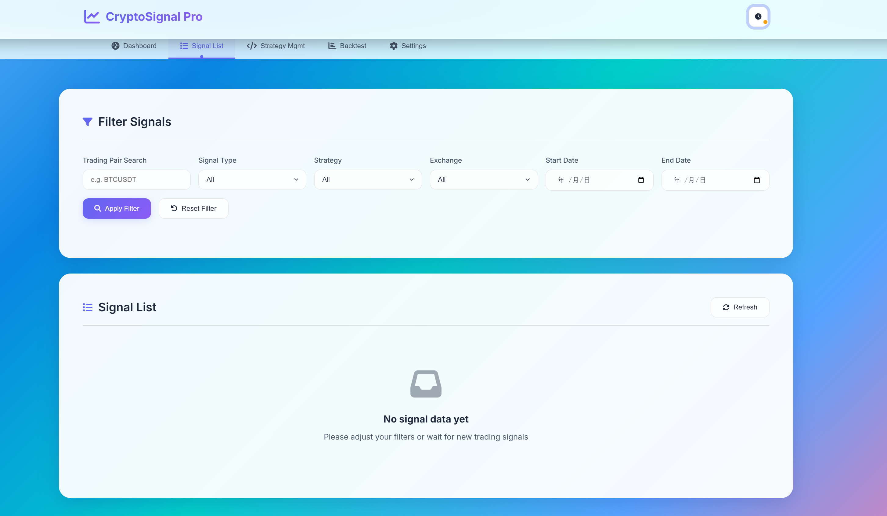
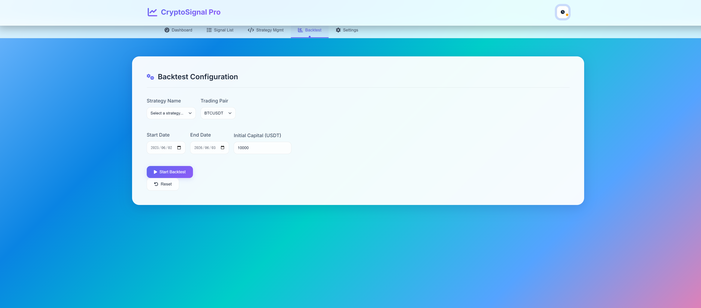
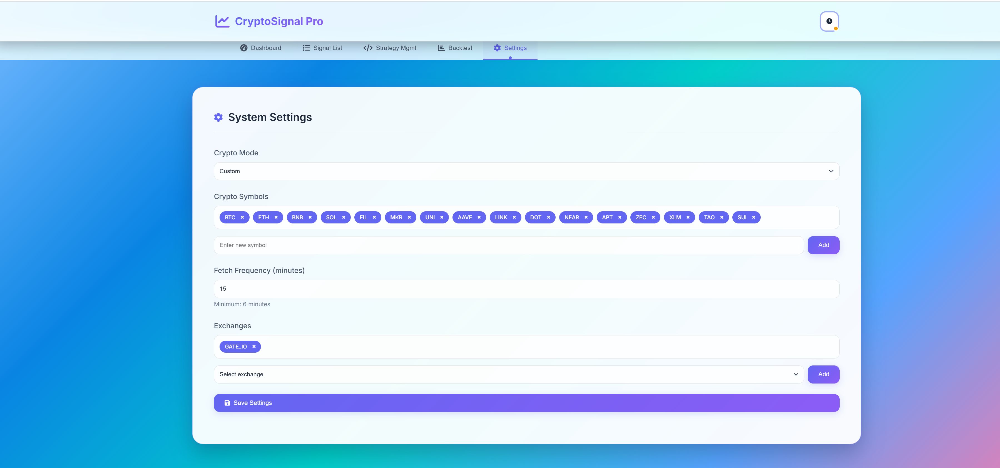

> [中文版本](README_CN.md)

# Crypto Trading

[](https://github.com/DruidSpirit/crypto-trading/actions/workflows/ci.yml)
[](LICENSE)
[](pom.xml)
[](python-strategy-service/README.md)

> **Disclaimer**: Crypto Trading is research software for strategy development and signal analysis. It is not financial advice. Always validate strategies independently before using real funds.

## 📖 Project Overview

**Crypto Trading** is an open-source crypto trading signal platform that crawls historical K-line data from public APIs of major cryptocurrency exchanges and generates trading signals with user-defined strategies. The project features a dual Java + Python architecture with Elder triple-filter strategies built in, along with flexible extensibility, multi-threaded data fetching, and proxy configuration support.

### ✨ Core Features

- **Data crawling**: Fetch historical K-line data from Binance, OKX, Gate.io, Bybit, and more.
- **Signal generation**: Generate buy/sell signals with custom strategies.
- **Python strategy engine**: Write trading strategies in Python with hot-reload support.
- **High performance**: Multi-proxy, multi-threaded data fetching.
- **Web console**: Built-in dashboard for monitoring signals, backtesting strategies in real time.

---

## 🖥 Screenshots

### Dashboard



### Signal List


### System Settings


### Backtesting



### Strategy Management



---

## 🧭 Project Status and Roadmap

Crypto Trading is maintained as an open-source research and signal-analysis platform. Current focus areas:

- Keep Java and Python strategy execution stable through CI.
- Improve strategy upload, hot reload, and backtest workflows.
- Add stronger exchange API compatibility checks.
- Add Docker Compose support for easier local evaluation.
- Expand strategy examples and backtest report exports.

---

## 🚀 Quick Start (Production)

### Requirements

- **Java**: JRE 17 or above
- **Python**: 3.9 or above

### Windows

1. Download and extract `crypto-trading-release.zip`.
2. **First** double-click `start-python.bat` to start the Python strategy service (dependencies auto-install on first run).
3. **Then** double-click `start-java.bat` to start the Java backend.
4. Open browser at http://localhost:5567

### Linux / macOS

1. Download and extract `crypto-trading-release.zip`.
2. Make scripts executable:
   
   ```bash
   chmod +x start-python.sh start-java.sh
   ```
3. Start the Python strategy service first:
   
   ```bash
   ./start-python.sh
   ```
4. Then start the Java backend (in a new terminal window):
   
   ```bash
   ./start-java.sh
   ```
5. Open browser at http://localhost:5567

> **Note**:
> 
> - The Python service **must be started before** the Java backend. Close the terminal window to stop a service.
> - After startup, wait a few minutes for data fetching. Refresh the page to view the latest trading signals.
> - If the application cannot start, check whether ports `5567` (Java) and `8001` (Python) are already in use:
>   
>   ```bash
>   netstat -aon | findstr :5567  # Windows
>   lsof -i :5567                 # Linux/macOS
>   ```

---

## 🛠 Usage Guide

### Data Fetching Configuration

- **Default exchange**: Gate.io (changeable in the settings page).
- **Proxy support**:
  - Add proxies when data fetching is slow.
  - Multiple proxies enable multi-threaded crawling and improve throughput.
  - **Recommendation**: On low-spec machines, configure no more than 10 proxies to avoid performance bottlenecks.
- **Symbol selection**:
  - Fetch specific trading pairs with custom configuration.
  - Or choose `all` mode to crawl all exchange data.
  - **Warning**: `all` mode fetches a large amount of data. Use it carefully when proxy capacity is limited.

### Custom Trading Strategies (Java)

1. **Implementation steps**:
   - Extend `AbstractTradeStrategy`.
   - Override the `doHandle` method and return a `TradeStrategyDTO`.
2. **Code example**: See the [RSI+ATR breakout strategy example](#rsiatr-breakout-strategy-example) below.

### Custom Trading Strategies (Python)

1. Create a new `.py` file in `python-strategy-service/src/strategies/`.
2. Extend `BaseTradeStrategy`, implement `execute()` and `get_strategy_name()`.
3. Upload via the web UI strategy management page, or place in the directory and hot-reload.

---

## 📈 RSI+ATR Breakout Strategy Example

The following example shows a custom `RsiAtrBreakoutStrategy`. It uses RSI to determine trend direction, and ATR plus Bollinger Bands to identify breakout signals.

```java
package druid.elf.tool.service.strategy.impl;

import druid.elf.tool.enums.KlineInterval;
import druid.elf.tool.service.strategy.AbstractTradeStrategy;
import druid.elf.tool.service.strategy.TradeStrategyDTO;
import lombok.extern.slf4j.Slf4j;
import org.springframework.stereotype.Component;
import org.ta4j.core.BarSeries;
import org.ta4j.core.Indicator;
import org.ta4j.core.indicators.ATRIndicator;
import org.ta4j.core.indicators.RSIIndicator;
import org.ta4j.core.indicators.SMAIndicator;
import org.ta4j.core.indicators.bollinger.BollingerBandsLowerIndicator;
import org.ta4j.core.indicators.bollinger.BollingerBandsMiddleIndicator;
import org.ta4j.core.indicators.bollinger.BollingerBandsUpperIndicator;
import org.ta4j.core.indicators.helpers.ClosePriceIndicator;
import org.ta4j.core.indicators.statistics.StandardDeviationIndicator;
import org.ta4j.core.num.Num;
import java.math.BigDecimal;
import java.math.RoundingMode;
import java.time.LocalDateTime;
import java.time.format.DateTimeFormatter;
import java.util.Map;

/**
 * RSI+ATR breakout strategy.
 * - Uses 4-hour RSI to determine trend direction (overbought/oversold).
 * - Uses 1-hour Bollinger Bands to confirm breakout signals and set take-profit.
 * - Uses 15-minute ATR to set stop-loss.
 */
@Component
@Slf4j
public class RsiAtrBreakoutStrategy extends AbstractTradeStrategy {

    private static final int CRYPTO_SCALE = 8; // Cryptocurrency price precision: 8 decimal places

    @Override
    protected TradeStrategyDTO doHandle(Map<String, BarSeries> seriesMap) {
        log.info("Starting RSI+ATR breakout strategy...");

        // Get K-line data for different timeframes
        BarSeries fourHSeries = seriesMap.get(KlineInterval._4H.name());
        BarSeries oneHSeries = seriesMap.get(KlineInterval._1H.name());
        BarSeries fifteenMSeries = seriesMap.get(KlineInterval._15M.name());

        // Validate input data
        if (fourHSeries == null || oneHSeries == null || fifteenMSeries == null) {
            log.warn("K-line data is incomplete: 4H={}, 1H={}, 15M={}", fourHSeries, oneHSeries, fifteenMSeries);
            return null;
        }
        log.info("K-line data loaded: 4H={} bars, 1H={} bars, 15M={} bars",
                fourHSeries.getBarCount(), oneHSeries.getBarCount(), fifteenMSeries.getBarCount());

        // Get latest indexes
        int lastIndex4H = fourHSeries.getEndIndex();
        int lastIndex1H = oneHSeries.getEndIndex();
        int lastIndex15M = fifteenMSeries.getEndIndex();

        // Step 1: Use 4-hour RSI to determine trend direction
        log.info("Step 1: Calculating 4-hour RSI trend...");
        Indicator<Num> close4H = new ClosePriceIndicator(fourHSeries);
        RSIIndicator rsi4H = new RSIIndicator(close4H, 14);
        Num rsiLast = rsi4H.getValue(lastIndex4H);
        Num rsiPrev = rsi4H.getValue(lastIndex4H - 1);

        boolean isBullish = rsiPrev.doubleValue() < 40 && rsiLast.doubleValue() > 40; // RSI exits weak zone
        boolean isBearish = rsiPrev.doubleValue() > 60 && rsiLast.doubleValue() < 60; // RSI exits strong zone

        if (!isBullish && !isBearish) {
            log.info("RSI trend is unclear, strategy stopped");
            return null;
        }
        log.info("RSI trend: bullish={}, bearish={}", isBullish, isBearish);

        // Step 2: Use 1-hour Bollinger Bands to detect breakouts and set take-profit
        log.info("Step 2: Calculating 1-hour Bollinger Band breakout signal...");
        Indicator<Num> close1H = new ClosePriceIndicator(oneHSeries);
        BollingerBandsMiddleIndicator bbMiddle1H = new BollingerBandsMiddleIndicator(new SMAIndicator(close1H, 20));
        Indicator<Num> deviation1H = new StandardDeviationIndicator(close1H, 20);
        BollingerBandsUpperIndicator bbUpper1H = new BollingerBandsUpperIndicator(bbMiddle1H, deviation1H, oneHSeries.numOf(2));
        BollingerBandsLowerIndicator bbLower1H = new BollingerBandsLowerIndicator(bbMiddle1H, deviation1H, oneHSeries.numOf(2));

        Num currentPrice = close1H.getValue(lastIndex1H);
        Num bbUpperLast = bbUpper1H.getValue(lastIndex1H);
        Num bbLowerLast = bbLower1H.getValue(lastIndex1H);

        // Detect breakout direction
        boolean breakUpper = isBullish && currentPrice.isGreaterThan(bbUpperLast);
        boolean breakLower = isBearish && currentPrice.isLessThan(bbLowerLast);
        if (!breakUpper && !breakLower) {
            log.info("No Bollinger Band breakout detected, strategy stopped");
            return null;
        }

        BigDecimal buyPrice = new BigDecimal(currentPrice.toString()).setScale(CRYPTO_SCALE, RoundingMode.HALF_UP);
        BigDecimal takeProfit = isBullish 
            ? new BigDecimal(bbUpperLast.multipliedBy(oneHSeries.numOf(1.02)).toString()).setScale(CRYPTO_SCALE, RoundingMode.HALF_UP)
            : new BigDecimal(bbLowerLast.multipliedBy(oneHSeries.numOf(0.98)).toString()).setScale(CRYPTO_SCALE, RoundingMode.HALF_UP);
        log.info("Breakout direction: {}, buy price={}, take profit={}", isBullish ? "upper band" : "lower band", buyPrice, takeProfit);

        // Step 3: Use 15-minute ATR to set stop-loss
        log.info("Step 3: Calculating 15-minute ATR stop-loss...");
        ATRIndicator atr15M = new ATRIndicator(fifteenMSeries, 14);
        Num atrValue = atr15M.getValue(lastIndex15M);
        Num stopLossPrice = isBullish 
            ? currentPrice.minus(atrValue.multipliedBy(fifteenMSeries.numOf(2)))
            : currentPrice.plus(atrValue.multipliedBy(fifteenMSeries.numOf(2)));
        BigDecimal stopLoss = new BigDecimal(stopLossPrice.toString()).setScale(CRYPTO_SCALE, RoundingMode.HALF_UP);
        log.info("ATR value={}, stop loss={}", atrValue, stopLoss);

        // Calculate profit-loss ratio
        BigDecimal profit = takeProfit.subtract(buyPrice).abs();
        BigDecimal loss = buyPrice.subtract(stopLoss).abs();
        BigDecimal profitLossRatio = loss.compareTo(BigDecimal.ZERO) > 0 
            ? profit.divide(loss, CRYPTO_SCALE, RoundingMode.HALF_UP) 
            : BigDecimal.ZERO;
        log.info("Profit-loss ratio: {}", profitLossRatio);

        // Build the trading signal
        TradeStrategyDTO dto = new TradeStrategyDTO();
        dto.setSignal(isBullish ? "BUY" : "SELL");
        dto.setPrice(buyPrice);
        dto.setBuyPrice(buyPrice);
        dto.setTakeProfit(takeProfit);
        dto.setStopLoss(stopLoss);
        dto.setProfitLossRatio(profitLossRatio);
        dto.setExpiration(LocalDateTime.now().plusHours(8).format(DateTimeFormatter.ofPattern("yyyy-MM-dd HH:mm:ss")));
        dto.setRemark("RSI+ATR breakout strategy");

        log.info("Trading signal generated: {}", dto);
        return dto;
    }

    @Override
    public String getStrategyName() {
        return "RsiAtrBreakoutStrategy";
    }
}
```

### Output Example

```text
Signal: BUY
Current price: 65000.00
Buy price: 65000.00
Take-profit price: 66300.00
Stop-loss price: 64000.00
Profit-loss ratio: 1.3
Expiration: 2025-02-27 20:00:00
Remark: RSI+ATR breakout strategy
```

---

## 🌟 Roadmap

1. **Introduce AI capabilities**
   
   - Dynamically generate trading strategies with AI.
   - Analyze historical data with machine learning, optimize parameters, integrate the results into the system, and improve signal accuracy.

2. **Enhance Python strategy ecosystem**
   
   - Enrich the built-in Python strategy library to lower the barrier to entry.
   - Support online strategy editing and debugging.
   - Use the Python ecosystem (Pandas, TA-Lib, etc.) to improve extensibility and flexibility.

3. **Docker containerized deployment**
   
   - Provide a one-click Docker deployment solution for hassle-free setup.

---

## 📂 Project Structure

```text
├── src/                                # Java backend source
│   └── main/java/druid/elf/tool/
│       ├── controller/                 # REST API controllers
│       ├── service/                    # Business logic
│       │   ├── exchangedata/           # Exchange data crawling
│       │   ├── strategy/               # Trading strategies
│       │   │   └── impl/
│       │   │       ├── ElderIntradayStrategyAdapter.java
│       │   │       └── ElderSwingStrategyAdapter.java
│       │   └── task/                   # Scheduled tasks
│       ├── entity/                     # Database entities
│       ├── dto/                        # Data transfer objects
│       └── enums/                      # Enumerations
├── python-strategy-service/            # Python strategy service
│   ├── main.py                         # FastAPI entry point
│   ├── src/strategies/                 # Python strategy implementations
│   ├── src/utils/                      # Technical indicators & backtest engine
│   └── requirements.txt
├── pack-release.bat                    # One-click packaging script
├── release-template/                   # Production startup script templates
└── pom.xml
```

---

## 🤝 How to Contribute

Contributions of any kind are welcome.

- **Report issues**: Submit an [Issue](https://github.com/your-repo/issues) with a detailed description and reproduction steps.
- **Submit code**: Open a [Pull Request](https://github.com/your-repo/pulls), follow the code style, and add necessary comments.

---

<div align="center">
  <p>⭐ If you like this project, please give us a Star! ⭐</p>
</div>
